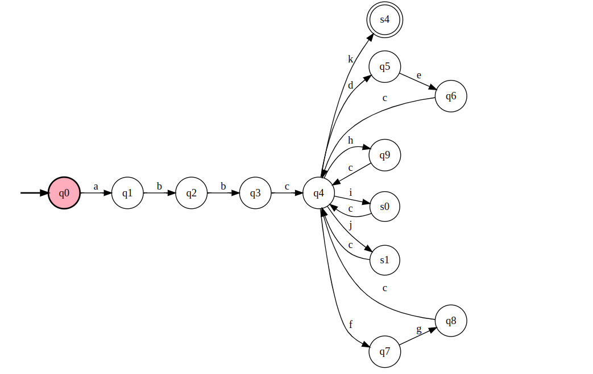

# Finite Automaton - Autonomous Vehicle

This project implements a **deterministic finite automaton (DFA)** that simulates the behavior of an autonomous vehicle in different situations such as traffic lights, obstacles, turns, and reaching the destination.

The project was developed as part of the **Formal Languages and Automata** course in the Computer Science undergraduate program.

## 🚗 How It Works

The automaton includes:

- An **initial state**: `Desligado` (Off)
- A set of **intermediate states** like `Ligado` (On), `Rodando` (Driving), `ParadoSemaforo` (StoppedAtTrafficLight), among others
- A **final state**: `DestinoAlcancado` (DestinationReached)
- A set of **transitions** that simulate real-world vehicle events

The input is a **tape of commands** representing the vehicle's events or actions, such as:

- `Ligar` (TurnOn), `DetectaRua` (DetectStreet), `Avancar` (MoveForward), `CurvaEsquerda` (TurnLeft), `ObstaculoDetectado` (ObstacleDetected), etc.

## 📂 Project Structure

- `AutomatoVeiculoAutonomo`: the class that defines the automaton with its states and transitions
- `processar_entrada(fita)`: the method that processes a sequence of inputs (events)
- Test cases to demonstrate valid and invalid behaviors

## ✅ Test Examples

### ✔️ Valid input:
```python
["Ligar", "DetectaRua", "DetectaRua", "Avancar", "CurvaDireita", "Avancar", "ReduzirVelocidade", "Avancar", "DestinoAlcancado"]
```

### ❌ Invalid input:
```python
["Ligar", "Avancar", "DestinoAlcancado"]
```

## 🧭 Automaton Diagram

Below is the visual representation of the autonomous vehicle automaton generated by the FSM Simulator:



### Consider that:
Alphabet
- a: Connect
- b: DetectStreet
- c: Next
- d: DetectRedTrafficLight
- e: DetectsGreenTrafficLight
- f: ObstacleDetected
- g: ObstacleFree
- h: LeftCurve
- i: RightCurve
- j: ReduceSpeed
- k: DestinationReached
  
States
- q0: Off (Initial)
- q1: On
- q2: InitializingSensors
- q3: ReadyToRun
- q4: Running
- q5: StoppedAtTrafficLight
- q6: Moving
- q7: StoppedAtObstacle
- q8: AvoidingObstacle
- q9: TurningLeft
- s0: TurningRight
- s1: ReducingSpeed
- s2: Accelerating
- s3: Emergency
- s4: DestinationReached (Accepting)

